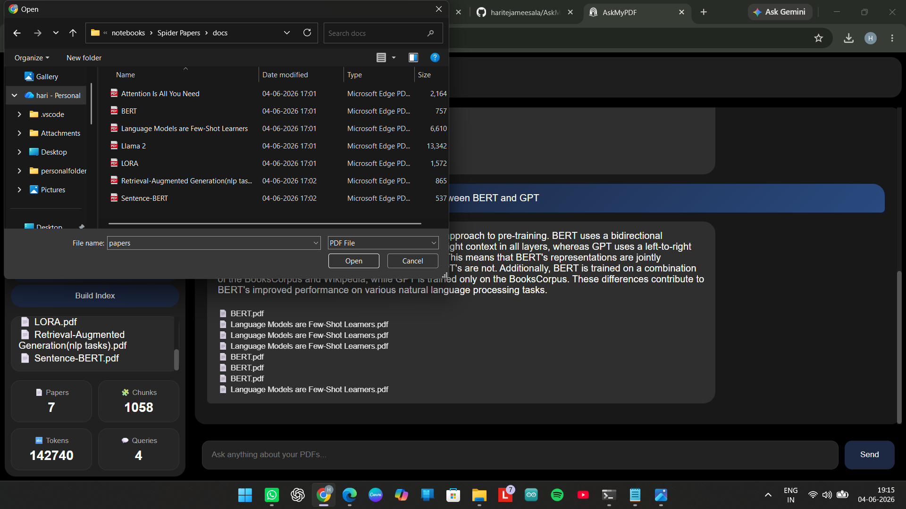
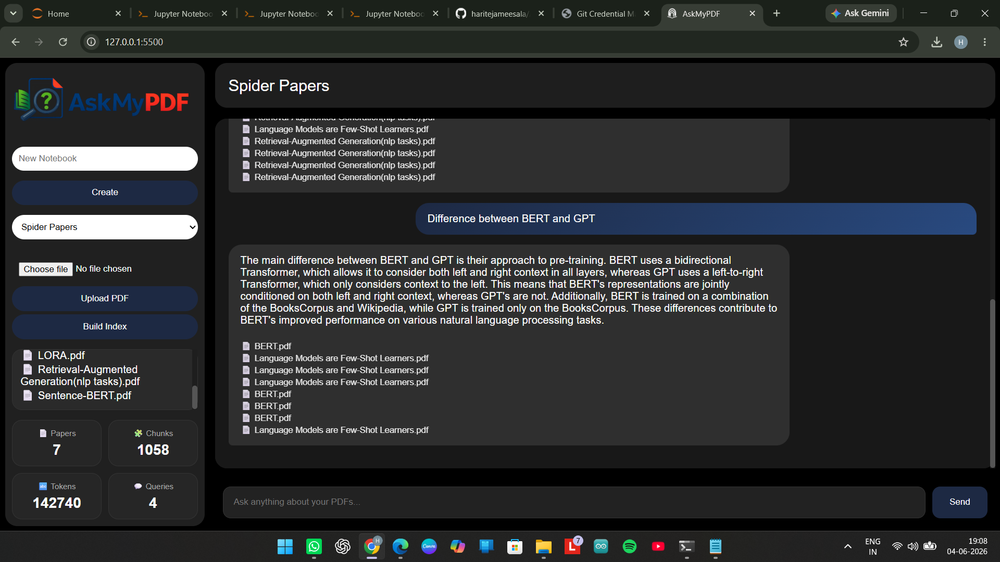

# Spider ML Task 1

This repository contains my submission for **Spider R&D ML Task 1**, including the Base Task, Applied ML Domain Task, and Bonus Task.

---

## Repository Structure

```text
spider_ml_task_1/
│
├── README.md
├── requirements.txt
│
├── applied_ml_domain/
│   ├── chatbot_code/
│   │   ├── Backend/
│   │   │   ├── pipeline/
│   │   │   │   ├── chunking.py
│   │   │   │   ├── data_loader.py
│   │   │   │   ├── embedding.py
│   │   │   │   ├── faissvectorstore.py
│   │   │   │   ├── llm.py
│   │   │   │   └── retrieve.py
│   │   │   │
│   │   │   ├── build_index.py
│   │   │   ├── main.py
│   │   │   └── rag_chain.py
│   │   │
│   │   └── Frontend/
│   │       ├── images/
│   │       │   ├── Logo.png
│   │       │   └── favicon.png
│   │       │
│   │       ├── index.html
│   │       ├── script.js
│   │       └── style.css
│   │
│   └── screenshots/
│       ├── Screenshot-1.png
│       └── Screenshot-2.png
│
├── base_task/
│   ├── images/
│   │   ├── Accuracy vs Epochs.png
│   │   ├── Loss vs Epochs.png
│   │   └── Some_wrongly_predicted_images.png
│   │
│   ├── README.md
│   ├── best_model.pkl
│   ├── notebook.ipynb
│   └── submission.csv
│
└── bonus_task/
    ├── results/
    │   ├── Autoencoder Loss vs Epoch.png
    │   └── comparison_Original_vs_Reconstructed.png
    │
    ├── Bonus_task_code.ipynb
    ├── README.md
    └── best_autoencoder.pkl
```

---

# Tasks Completed

## 1. Base Task – Fashion-MNIST Classification

Implemented the neural network architecture provided in the task using PyTorch and trained it on the Fashion-MNIST dataset.

### Features

- Custom neural network implementation
- Training and validation pipeline
- Accuracy and loss tracking
- Model checkpoint saving
- Test prediction generation
- Submission file creation
- Misclassification analysis

### Results

The project includes:

- Training Accuracy vs Epochs
- Validation Accuracy vs Epochs
- Training Loss vs Epochs
- Validation Loss vs Epochs
- Visualization of wrongly predicted samples

---

## 2. Applied ML Domain – AskMyPDF

### Overview

AskMyPDF is a Retrieval-Augmented Generation (RAG) application that enables users to upload research papers, build vector databases, and interact with their documents using natural language questions.

The system combines semantic retrieval and Large Language Models to generate context-aware answers grounded in the uploaded research papers.

### Features

- Create multiple notebooks/workspaces
- Upload PDF research papers
- Automatic PDF text extraction
- Intelligent document chunking
- Embedding generation using HuggingFace models
- FAISS-based vector indexing
- MMR-based retrieval for diverse and relevant context selection
- Question answering using Groq Llama 3.3
- Source-aware responses
- Notebook statistics

Statistics tracked:

- Number of uploaded papers
- Number of chunks
- Number of tokens
- Number of queries

### Backend Architecture

The backend is built using FastAPI and follows a modular pipeline design.

#### Document Processing Pipeline

**data_loader.py**
- Loads uploaded PDFs and extracts text.

**chunking.py**
- Splits documents into smaller overlapping chunks.

**embedding.py**
- Embedding generation using Sentence Transformers
- Model: all-MiniLM-L6-v2

**faissvectorstore.py**
- Creates and manages FAISS vector databases.

**retrieve.py**
- Retrieves relevant chunks using Max Marginal Relevance (MMR) retrieval to balance relevance and diversity.

**llm.py**
- Handles communication with Groq Llama 3.3.

**rag_chain.py**
- Combines retrieval and generation into a complete RAG workflow.

### API Layer

**main.py**
- Defines API endpoints and request handling.

**build_index.py**
- Builds and updates vector indexes for uploaded documents.

### Frontend

Built using:

- HTML
- CSS
- JavaScript

Frontend Features:

- Notebook management
- PDF uploads
- Index creation
- Question answering interface
- Chat-style interaction
- Statistics dashboard

### Workflow

```text
PDF Upload
     │
     ▼
Text Extraction
     │
     ▼
Chunking
     │
     ▼
Embedding Generation
     │
     ▼
FAISS Vector Store
     │
     ▼
User Query
     │
     ▼
MMR Retrieval
     │
     ▼
Relevant Context
     │
     ▼
Groq Llama 3.3
     │
     ▼
Generated Answer
```

### Technologies Used

#### Backend

- FastAPI
- LangChain
- FAISS
- HuggingFace Embeddings
- Groq API

#### Frontend

- HTML
- CSS
- JavaScript

### Screenshots

#### Main Interface



#### Question Answering Interface



### Learning Outcomes

This project provided hands-on experience with:

- Retrieval-Augmented Generation (RAG)
- Vector Databases
- Semantic Search
- Embedding Models
- FastAPI Development
- Frontend-Backend Integration
- LLM-Based Applications

---

## 3. Bonus Task – Fashion-MNIST Autoencoder

### Overview

Implemented an Autoencoder using PyTorch to learn compressed latent representations of Fashion-MNIST images and reconstruct them.

### Architecture

#### Encoder

- Linear(784 → 128)
- ReLU
- Linear(128 → 64)
- ReLU
- Linear(64 → 32)
- ReLU

#### Latent Space

- 32-dimensional representation

#### Decoder

- Linear(32 → 64)
- ReLU
- Linear(64 → 128)
- ReLU
- Linear(128 → 784)
- Sigmoid

### Features

- Encoder–Decoder architecture
- Latent representation learning
- Image reconstruction
- Training and validation monitoring
- Reconstruction quality visualization

### Results

The project includes:

- Autoencoder loss curves
- Original vs reconstructed image comparisons
- Reconstruction quality analysis

---

## Installation

### Clone Repository

```bash
git clone https://github.com/haritejameesala/spider_ml_task_1.git
cd spider_ml_task_1
```

### Install Dependencies

```bash
pip install -r requirements.txt
```

---

## Author

**Hari Teja Meesala**  
B.Tech Computer Science and Engineering  
National Institute of Technology Tiruchirappalli (NIT Trichy)
